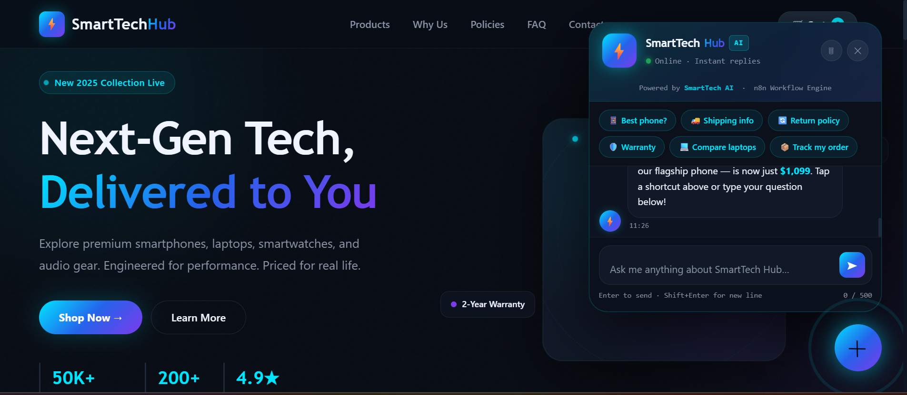
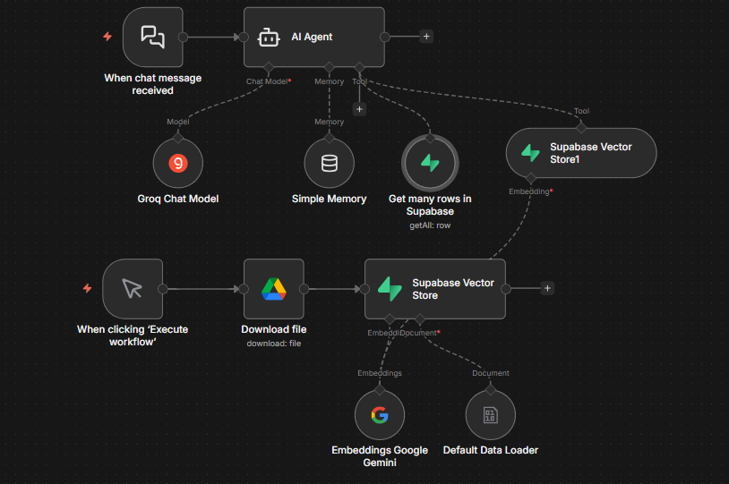
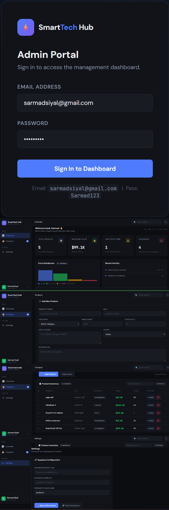
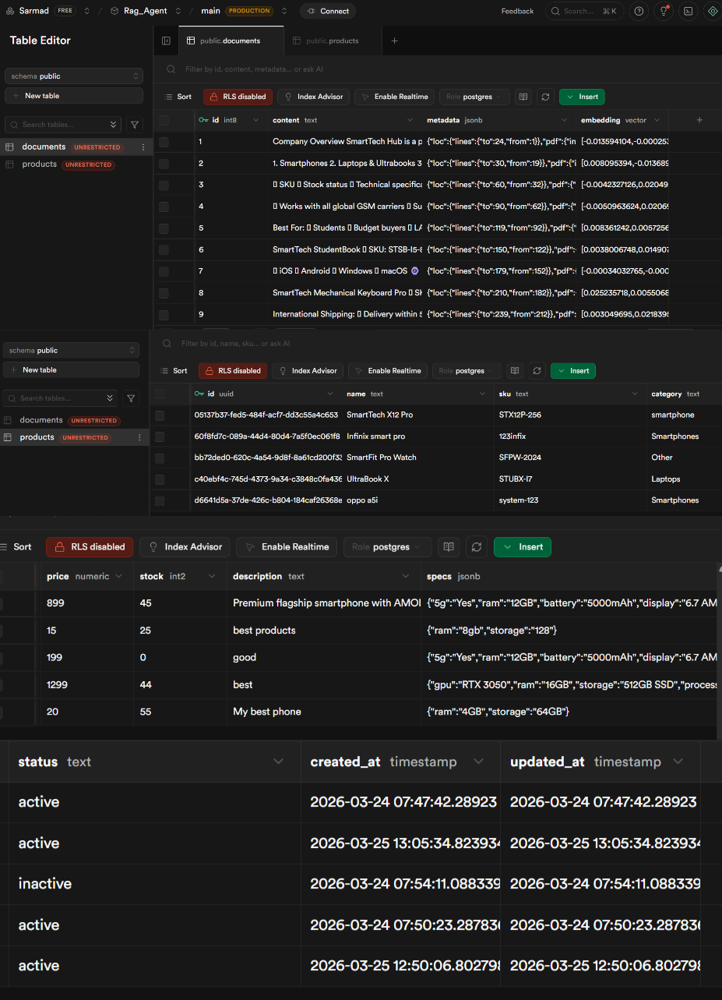

# 🚀 SmartTech Hub – AI Commerce Automation Platform

💡 **AI-Powered E-commerce Automation System with Real-Time Data & Intelligent Agents**

---

## 🧠 Overview

SmartTech Hub is a **production-ready AI commerce automation platform** designed to automate customer interactions, product management, and inventory operations.

It combines **AI agents, live databases, and automation workflows** to deliver accurate, real-time responses without hallucination.

---

## 🎯 Objectives

* Provide **accurate AI-driven customer support**
* Prevent incorrect or hallucinated responses
* Use **real-time product database** for pricing & stock
* Separate **static knowledge (vector DB)** and **dynamic product data**
* Enable admins to manage products via dashboard
* Build a **scalable AI commerce system**

---

## 🏗️ System Architecture

### 🧩 1. Customer Interface Layer

* Website with chatbot UI
* Sends queries via webhook
* Real-time AI interaction

---

### 🤖 2. AI Processing Layer (n8n)

* Webhook Trigger
* AI Agent (Groq LLaMA 3)
* Product Database Tool (Supabase)
* Vector Knowledge Tool
* Response Formatter

👉 AI strictly follows **grounding rules** (no guessing)

---

### 🗄️ 3. Data Layer (Supabase)

#### 📦 Products Table

Stores real-time data:

* Name, SKU, Category
* Price, Stock
* Description, Specs

#### 📚 Vector Database (Documents Table)

Stores:

* FAQs
* Policies
* Company information

⚠️ Product data is NOT stored in vector DB (prevents errors)

---

### 🧑‍💼 4. Admin Management Layer

Custom Admin Dashboard (HTML App)

Features:

* Add Product
* View Products
* Edit Product
* Delete Product
* Live database sync

---

## 🔄 How It Works

### 1️⃣ Admin Updates Product

* Admin submits form
* Data stored in Supabase
* Instant update

---

### 2️⃣ Customer Sends Query

Example:

> “What is the price of SmartTech X12 Pro?”

---

### 3️⃣ Webhook Trigger

* Chatbot sends request to n8n

---

### 4️⃣ AI Processing

AI decides:

* Product-related → Query database
* Policy-related → Use vector DB

---

### 5️⃣ Database Response

Returns:

* Exact price
* Stock availability
* Product details

---

### 6️⃣ AI Response Generation

* Uses real data only
* Formats response professionally
* Applies stock logic

---

### 7️⃣ Final Output

* Sent back to chatbot
* Displayed to user

---

## 🛡️ Anti-Hallucination System

* Strict AI prompt rules
* Database grounding
* No mixing of data sources
* Fallback for missing data
* Stock-aware responses

👉 Ensures **100% reliable output**

---

## ⚙️ Admin Dashboard (CRUD Operations)

* CREATE → Add product
* READ → View products
* UPDATE → Edit product
* DELETE → Remove product

All operations directly update **Supabase products table**

---

## 🛠️ Tech Stack

### 🤖 AI & Automation

* n8n
* Groq LLaMA 3

### 🗄️ Backend & Database

* Supabase (PostgreSQL + Vector DB)
* Supabase JS SDK

### 🌐 Frontend

* HTML
* CSS
* JavaScript

---

## ✨ Key Features

✔ AI-powered product Q&A
✔ Real-time database integration
✔ Admin dashboard (CRUD)
✔ Vector knowledge base
✔ Anti-hallucination system
✔ Modular architecture
✔ Scalable design
✔ Live inventory awareness

---

## 🔐 Security

* Public anon key (frontend)
* Service role key (backend only)
* Optional Row-Level Security (RLS)
* Controlled AI responses

---

## 📈 Scalability

Future improvements:

* Order management system
* Payment integration
* Multi-agent AI system
* Analytics dashboard
* Stock alerts
* WhatsApp/Telegram bots
* Shopify integration

---

## 📸 Screenshots

### 💬 Chatbot User Interface

 

### ⚙️ n8n Workflow Automation

 

### 🧑‍💼 Admin Dashboard

 

### 🗄️ Database Schema

## ⚙️ Setup Guide

Follow these steps to set up and run the SmartTech Hub AI system locally:

---

### 🔧 1. Import n8n Workflow

* Open your n8n instance
* Go to **Workflows → Import**
* Upload the provided workflow JSON file
* Verify all nodes are correctly connected

---

### 🔐 2. Configure Environment Variables & Credentials

#### 🗄️ Supabase Configuration

* Create a project in Supabase
* Copy:

  * Project URL
  * Anon Public Key
* Add them in n8n credentials and frontend config

---

#### 🤖 AI Model (Groq API)

* Get API key from Groq
* Add API key inside n8n AI node
* Select LLaMA model (recommended: LLaMA 3)

---

### 🗃️ 3. Database Setup (Supabase)

Create the following tables:

#### 📦 Products Table

Include fields:
`id, name, sku, category, price, stock, description, specs, status, created_at, updated_at`

---

#### 📚 Documents Table (Vector DB)

Include fields:
`content, embeddings, metadata`

👉 Ensure product data is stored ONLY in products table

---

### 🔗 4. Configure Webhook

* Copy webhook URL from n8n
* Paste into chatbot frontend code
* Ensure method is set to **POST**
* Test endpoint using sample request

---

### 💬 5. Deploy Chatbot UI

* Open chatbot HTML file
* Update webhook URL
* Host using:

  * Local server (for testing)
  * Or deploy on Vercel / Netlify

---

### 🧑‍💼 6. Setup Admin Dashboard

* Open Admin Dashboard HTML file
* Add:

  * Supabase URL
  * Supabase Anon Key
* Test:

  * Add product
  * Edit product
  * Delete product

---

### 🧪 7. Test the System

Try sample queries:

* “What is the price of [Product Name]?”
* “Is this product in stock?”
* “What is your return policy?”

✅ Verify:

* Correct database response
* No hallucination
* Proper formatting

---

### 🚀 8. Activate Workflow

* Turn ON workflow in n8n
* Ensure all nodes are active
* Monitor executions for debugging

---

## ✅ System Ready

Your AI Commerce Automation Platform is now fully operational 🎉

